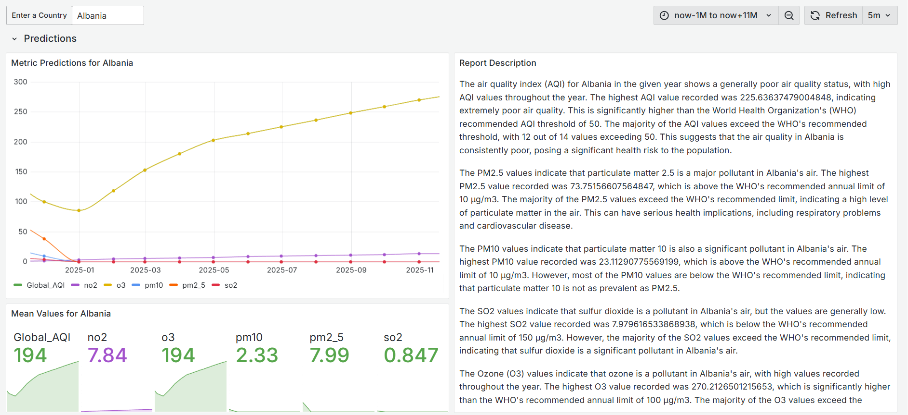

# 🌎 AWS Real time Air Quality Visualization, prediction and LLM reporting

## 📄 Description
This cloud-based solution monitors, analyzes, forecasts air quality and generates LLM-powered reports using real-time and historical data from the OpenWeather Air Pollution API. It empowers timely interventions, promotes cleaner practices, and raises awareness, contributing to improved public health, reduced pollution, and sustainable urban development.

## 📑 Table of Contents
- [📌 Overview](#📌-overview)
- [📁 Repository Structure](#📁-repository-structure)
- [🏗️ Architecture](#🏗️-architecture)
- [⚙️ Prerequisites](#⚙️-prerequisites)
- [🚀 Deployment Steps](#🚀-deployment-steps)  
   1. [Data Pipeline Setup](#🔧-data-pipeline-setup)  
        - [Step 1: Set up EC2 Instance with cloud9 environment](#💻-step-1-set-up-ec2-instance-with-cloud9-environment)  
        - [Step 2: Configure Kinesis Data Streams](#🔗-step-2-configure-kinesis-data-streams)  
        - [Step 3: Lambda Function Setup](#⚡-step-3-lambda-function-setup)  
        - [Step 4: Store Data in S3](#🗂️-step-4-store-data-in-s3)  
        - [Step 5: Set up AWS Glue Crawlers and Tables](#🔍-step-5-set-up-aws-glue-crawlers-and-tables)  
        - [Step 6: Query Data Using Athena](#📊-step-6-query-data-using-athena)  
        - [Step 7: Visualize with Grafana](#📈-step-7-visualize-with-grafana)    
    2. [LLM Integration](#🧠-llm-integration)
        - [Step 1: Set Grafana Variables](#⚙️-step-1-set-grafana-variables)  
        - [Step 2: Load the LLM](#📥-step-2-load-the-llm)
        - [Step 3: Setup ngrok](#🌐-step-3-setup-ngrok)
- [🎯 Results](#🎯-results)
- [🤝 Contributing](#🤝-contributing)

## 📌 Overview
This project is designed to collect, process, and visualize real-time weather data by leveraging AWS services, OpenWeather API, and machine learning tools. The pipeline automates the retrieval of weather data, stores it efficiently in the cloud, processes it for analytics, and makes it accessible for real-time visualization and predictive analysis.

### ⭐ Key Features:
#### 1. 📡 Real-time Data Ingestion:
Weather data is continuously fetched from the OpenWeather API using an EC2 instance, ensuring up-to-date weather information.

#### 2. 🔄 Data Streaming & Processing:
The data is streamed through Amazon Kinesis Data Streams, providing a scalable way to handle incoming data in real time. AWS Lambda functions are triggered to process the data, transforming it into a structured format and storing it in Amazon S3.

#### 3. 🔧 Data Transformation & Cataloging:
AWS Glue Crawlers automatically discover and catalog the processed data, while Amazon Athena allows users to run SQL queries on the stored data. This makes the data easily accessible for reporting and analysis.

#### 4. 📊 Visualization with Grafana:
Grafana is integrated to create dashboards that visualize key metrics like temperature, humidity, and weather conditions. This enables users to monitor trends and gain insights into the data in real time.

#### 5. 🤖 Machine Learning:
AWS SageMaker is used to train and deploy machine learning models for weather predictions, such as forecasting temperature or predicting weather conditions. These models are exposed through an API Gateway and can be accessed for inference.

#### 6. 🧠 Large Language Model (LLM) Integration:
Large Language Models (LLMs) are used for generating reports and gaining deeper insights into the weather data, making the information more accessible and understandable for decision-makers.

#### 7. 🔁 Automated Data Management:
The entire pipeline is automated, allowing for continuous updates, error handling, and scalability, ensuring that the system can handle a large volume of weather data efficiently.

## 📁 Repository Structure:
```bash
  .
  ├── Data Fetch
  │   └── fetch_data.py
  ├── Images
  ├── Lambda_function
  │   └── data_transformation.py
  ├── README.md
  ├── Report-Generation
  │   └── llm.py
  └── datasets
      ├── countries.csv
      └── data_schema.json
```

## 🏗️ Architecture

The following AWS services are used in the architecture:

1. **OpenWeather (API)**: Fetches real-time weather data.
2. **EC2**: Hosts a service that fetches data from OpenWeather API.
3. **Kinesis Data Stream**: Streams the weather data for further processing.
4. **Lambda**: Transforms the data and processes it.
5. **S3**: Stores the processed data in a structured format.
6. **Glue Crawlers**: Catalogs the data in S3 for querying.
7. **Athena**: Queries the data stored in S3.
8. **API Gateway**: Exposes the service to other applications or external consumers.
9. **Grafana**: Visualizes data using custom dashboards.
10. **SageMaker**: Deploys machine learning models.
11. **LLM Integration:** Large Language Models (LLMs) are integrated for report generation and deeper insights into predicted values.
12. **ngrok**: Exposes the local API Gateway for external testing.

<picture>
  <source media="(prefers-color-scheme: dark)" srcset="Images/Architecture-dark.png">
  <source media="(prefers-color-scheme: light)" srcset="Images/Architecture-light.png">
  
</picture>

## ⚙️ Prerequisites

To successfully set up and deploy this project, you will need the following:

### 1. **AWS Account**
   - An active AWS account with permissions to use services like EC2, S3, Lambda, Kinesis, Glue, Athena, SageMaker, and API Gateway.

### 2. **OpenWeather API Key**
   - Sign up at [OpenWeather](https://openweathermap.org/api) to get an API key for the Air Pollution API.

### 3. **AWS IAM Roles and Policies**
  - Create or configure IAM roles with permissions for the following services:
  - Amazon EC2
  - Amazon Kinesis
  - Amazon S3
  - AWS Lambda
  - AWS Glue
  - Amazon Athena
  - Amazon SageMaker
  - Attach policies like `AmazonS3FullAccess`, `AmazonKinesisFullAccess`, and `AWSLambdaBasicExecutionRole`.

### 4. **Python Environment**
   - Ensure Python 3.x is installed along with required libraries on your AWS EC2 and Lambda environment:
     ```bash
     pip install boto3 requests json time
     ```

### 6. **Grafana Setup**
   - Download Grafana for your environment or plan to set it up on an EC2 instance.
   - Guide: [Grafana Installation](https://grafana.com/docs/grafana/latest/setup-grafana/installation/).

### 7. **ngrok**
   - Install `ngrok` to expose local APIs for testing.
   - Download: [ngrok](https://ngrok.com/download).

### 8. **Access Credentials**
   - AWS access key ID and secret access key for programmatic access.
   - Ensure the credentials are stored securely using environment variables or AWS credentials files.

### 9. **System Requirements**
- **Operating System**: Linux, macOS, or Windows
- **RAM**: 16 GB or higher recommended
- **Storage**: At least 50 GB of free space (depending on model size)
- **Python**: 3.8 or higher

### 10. **GPU Requirements**
- **NVIDIA GPU**: Ensure you have an NVIDIA GPU with CUDA support for accelerated model training and inference.
- **CUDA and cuDNN**:  
  - Install [CUDA Toolkit](https://developer.nvidia.com/cuda-toolkit) (minimum version 11.x recommended).  
  - Install [cuDNN](https://developer.nvidia.com/cudnn).  
  - Verify installation by running:  
    ```bash
    nvidia-smi
    ```
    This will display GPU and CUDA driver details.
- **TensorFlow GPU**:  
  ```bash
  pip install tensorflow-gpu
  ```

- **PyTorch with GPU Support** (Optional if using PyTorch):
  ```bash
  pip install torch torchvision torchaudio --index-url https://download.pytorch.org/whl/cu118
  ```  
  Alternatively, follow the official installation guide [here](https://pytorch.org/get-started/locally/).

### 11. **Python Environment Setup**
- **Create Virtual Environment**:
  ```bash
  python3 -m venv venv
  source venv/bin/activate  # Linux
  ```
### 12. **Model and Hugging Face Setup**
- Install Hugging Face `transformers` and `datasets` libraries:
  ```bash
  pip install transformers datasets
  ```
- **Hugging Face Authentication**:
  ```bash
  huggingface-cli login
  ```
- Ensure you have access to the `meta-llama/Llama-3.2-3B-Instruct` model through Hugging Face.


## 🚀 Deployment Steps
### 🔧 Data Pipeline Setup

#### 💻 Step 1: Set up EC2 Instance with cloud9 environment 
1. Go to the Cloud9 dashboard in the AWS Management Console.
2. Launch a new Cloud9 environment with a new EC2 Instance.
    - Choose the instance type `t2.micro` with Amazon Linux.
    - Select the Secure Shell (SSH) connection type.
3. Open the Cloud9 IDE and install the necessary packages:
    ```bash
    sudo apt update
    sudo apt install python3-pip
    pip3 install boto3 requests csv time json io
    ```
5. Create a Python script (`fetch_data.py`) to fetch data from the OpenWeather API.
It is important to configure the Kinesis client before fetching the data and set up the AWS Credentials:
    ```python
    aws_region = "your-region-here"
    aws_access_key_id="aws-access-id"
    aws_secret_access_key="your-secret-access-keye-here"

    KINESIS_STREAM_NAME = "airpollution_data"

    kinesis_client = boto3.client('kinesis', 
        region_name=aws_region,
        aws_access_key_id=aws_access_key_id, 
        aws_secret_access_key=aws_secret_access_key,
        aws_session_token=aws_session_token)
    ```
##### Note: 
- It is necessary to have an S3 bucket named `useful-data-bucket` that containes the csv file `countries.csv`.


#### 🔗 Step 2: Configure Kinesis Data Streams 
1. Navigate to the **Kinesis** section in AWS Console and Click on **Create stream**.
2. Name your stream (e.g., `airpollution_data`), and define the number of shards based on your data volume or choose the `On-Demand` option.
3. Once the stream is created, ensure the EC2 instance has the proper IAM role to send data to Kinesis.

#### ⚡ Step 3: Lambda Function Setup 
1. Go to **AWS Lambda** and create a new function.
2. Select **Author from scratch** and use an the python runtime.
3. Set permissions for Lambda to read from Kinesis and write to S3.
4. Install the necessary packages:
    ```bash
    pip install boto base64 json datetime
    ```
5. Use the Lambda function (`data_transformation.py`) to format data and write it into the S3 bucket.

#### 🗂️ Step 4: Store Data in S3
1. Create an S3 bucket:
   - Go to **S3** in AWS Console and click **Create Bucket** and specify a unique name (e.g. `airquality-databucket`).
   - Set permissions and configure the bucket to store the processed weather data.
   - The data is stored in folders, each folder designating a specific country and its corresponding data.
2. Ensure that the Lambda function has the appropriate IAM role to write data to S3.

#### 🔍 Step 5: Set up AWS Glue Crawlers and Tables
1. Go to **AWS Glue Databases** and create a new Database with a unique name (e.g. `airquality_base`).
3. Go to **AWS Glue** and create a new Crawler.
4. - Define the source as the S3 bucket where weather data is stored.
    - Set the `airquality_base` database as the output.
    - Set up the crawler to run on a scheduled basis (e.g., every hour) to keep the Glue Catalog up-to-date.
5. After running the whole pipeline, navigate to the AWS Glue Table schema and make sure it is identical to `data_schema.json` or update it.

#### 📊 Step 6: Query Data Using Athena
1. In the **Athena** console, create a new database (for query results storage).
2. Define a table that references the Glue cataloged data in S3.
3. Run SQL queries to analyze the air quality data.
   Example query:
   ```sql
   SELECT * FROM "airquality_base"."airquality_databucket" limit 30;
   ```

#### 📈 Step 7: Visualize with Grafana

##### Install Grafana
To visualize the air pollution data, we installed Grafana on an `t2.medium` EC2 instance

##### Grafana Installation
1. Download and run Grafana:
    - Create an t2.medium EC2 Instance and update the inbound rules on port 3000
    - Open the Instance terminal and install Grafana
      ```bash
      sudo yum update -y
      sudo yum install grafana -y
      sudo systemctl daemon-reload
      ```
2. Create the file `credentials`in the folder path `usr/share/grafana/.aws` and store your AWS credentials inside.
    - These tokens are available in your AWS console under:
AWS Management Console → AWS Details section when you sign in to your AWS interface.
4. Launch and enable Grafana:
    ```bash
    sudo systemctl start grafana-server
    sudo systemctl enable grafana-server.service
    ```
2. Once Grafana is running, access it at `http://<instance-address>:3000`. The default credentials are:
    - Username: `admin`
    - Password: `admin`
3. After logging in, change the password for security purposes.

##### Add Athena as a Data Source
1. In Grafana, go to **Configuration** > **Data Sources** > **Add Data Source**.
2. Select **Athena** from the list of available data sources.
3. Enter the connection details:
    - **Name**: A name for the data source (e.g., `Athena Air Pollution Data`).
    - Use the `Credentials file` as the Authentication provider and select the region where your Athena queries will run.
    - **Athena Workgroup**: Specify the workgroup you are using (or leave default).
    - Select the **Database** and the **Table** you are qureing as well as the S bucket for query results' storage.

##### Create a Dashboard in Grafana
1. After configuring the Athena data source, create a new dashboard in Grafana.
2. Add panels for visualizing weather data.
3. Configure queries for each panel.


### 🧠 LLM Integration

This section demonstrates how to integrate a Large Language Model (LLM) into the project for enhanced report generation and insights.

<picture>
  <source media="(prefers-color-scheme: dark)" srcset="Images/llm-dark.png">
  <source media="(prefers-color-scheme: light)" srcset="Images/llm-light.png">
  
</picture>

#### ⚙️ Step 1: Set Grafana Variables
1. Open your Grafana Dashboard.
2. Navigate to **Settings** > **Variables**.
3. - Create a custom variable for each predicted Value as well as the month to generate the report on.
   - Set the data source as the source of the model prediction
4. Test the variables by applying them to a sample panel.

#### 📥 Step 2: Load the LLM
1. **Prepare the LLM Environment**:
   - Install the required Python libraries such as `transformers`, `flask` and `logging` (optional):
     ```bash
     pip install transformers flask logging
     ```
2. **Create a Script for LLM Integration**:
   - Write a Python script to query the LLM for analyzing the predicted values of pollutants and AQI: `llm.py`

3. **Integrate LLM Output into Grafana**:
   - Use Grafana's **Table Pannel** to display LLM-generated report.

#### 🌐 Step 3: Setup ngrok
1. **Install ngrok**:
   - Download and install ngrok from [ngrok.com](https://ngrok.com/).
   - Authenticate using your ngrok account:
     ```bash
     ngrok authtoken <YOUR_AUTH_TOKEN>
     ```

2. **Expose Local Services**:
   - Use ngrok to expose your local API Gateway or LLM services:
     ```bash
     ngrok http 5000
     ```

3. **Update API Endpoints**:
   - Copy the generated ngrok URL and use it in your Grafana data source to access the LLM service remotely.
   - Example:
     ```bash
     Forwarding    https://<unique-id>.ngrok.io -> localhost:5000
     ```


## 🎯 Results
### Data Visualisation Dashboard

#### 1. Total Data Count
- **Description**: Displays the total number of air quality data points.

#### 2. Air Quality Unique Count
- **Visualization**: Pie chart
- **Categories**:
  - Fair
  - Good
  - Poor
  - Very Poor
  - Moderate

#### 3. Average Air Quality Index by Continent
- **Visualization**: Bar chart

#### 4. Metric Impact
- **Visualization**: Scatter plot
- **Metrics**: Shows the impact of pollutants on AQI values.

#### 5. Top 10 Most Polluted Countries
- **Very Poor Regions**

#### 6. Top 5 Cleanest Countries
- **Good Regions**

#### 7. Value Ranges
- **Pollutant Levels**

#### 8. Air Pollution World Map
- **Visualization**: Global map with color-coded air quality labels:
  - Good
  - Fair
  - Poor
  - Very Poor

#### 9. Detailed Data Tooltip
- **Information Displayed on Hover**:
  - **Timestamp**
  - **Region**
  - **Continent**
  - **Longitude**
  - **Latitude**
  - **AQI Quality**
  - **Pollutant Levels**

**Purpose**: This dashboard provides a comprehensive overview of global air quality, offering insights into pollution levels, geographic distribution, and identifying clean and polluted regions.

<picture>
  <source media="(prefers-color-scheme: dark)" srcset="Images/vis1-dark.png">
  <source media="(prefers-color-scheme: light)" srcset="Images/vis1-light.png">
  
</picture>
<picture>
  <source media="(prefers-color-scheme: dark)" srcset="Images/vis2-dark.png">
  <source media="(prefers-color-scheme: light)" srcset="Images/vis2-light.png">
  
</picture>

### Air Quality Forecast and LLM-Generated Report Dashboard

#### Country Selection
- **Dropdown** to select a country for air quality predictions.

#### Metric Predictions for Selected Country
- **Visualization**: Line graph showing predictions for AQI and specific pollutants for the coming year.

#### Mean Values
- **Visualization**: Displays mean pollutant levels (Global_AQI, no2, o3, pm10, pm2_5, so2).

#### Report Description
- **Details**: 
  - Overview of air quality for the selected country.
  - Highlights of AQI levels compared to WHO recommendations.
  - Describes pollutants and their health implications.
  - Identifies key pollution sources and trends.

**Purpose**: This dashboard includes predictive analysis and detailed reports for specific countries.

<picture>
  <source media="(prefers-color-scheme: dark)" srcset="Images/pred-dark.png">
  <source media="(prefers-color-scheme: light)" srcset="Images/pred-light.png">
  
</picture>

## 🤝 Contributing
If you have suggestions for improving the pipeline or visualizations, feel free to fork the repository and submit pull requests.

### Contributing Guidelines:
1. **Fork** the repository and clone it locally.
2. Make your changes and ensure that new code adheres to the project's code standards.
3. **Test** your changes.
4. Create a **pull request** with a detailed description of your changes.